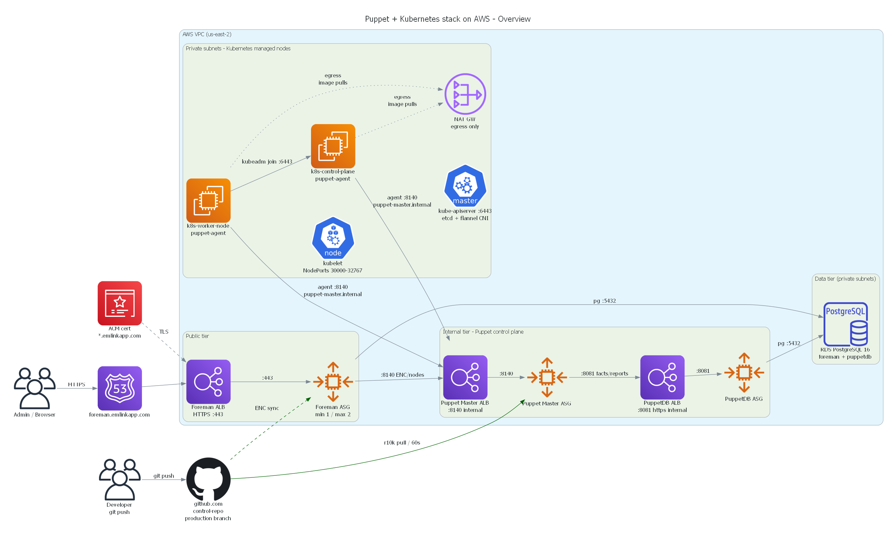
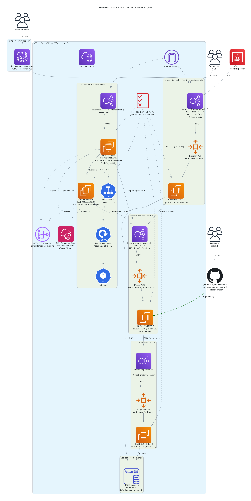
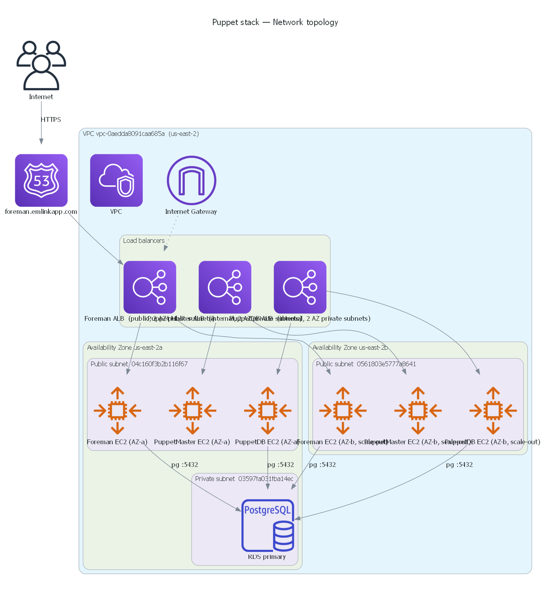
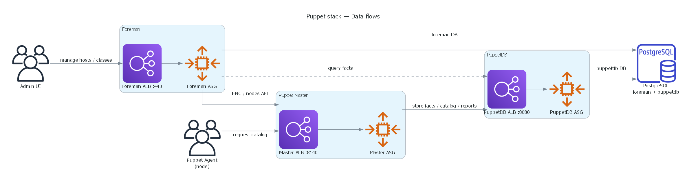
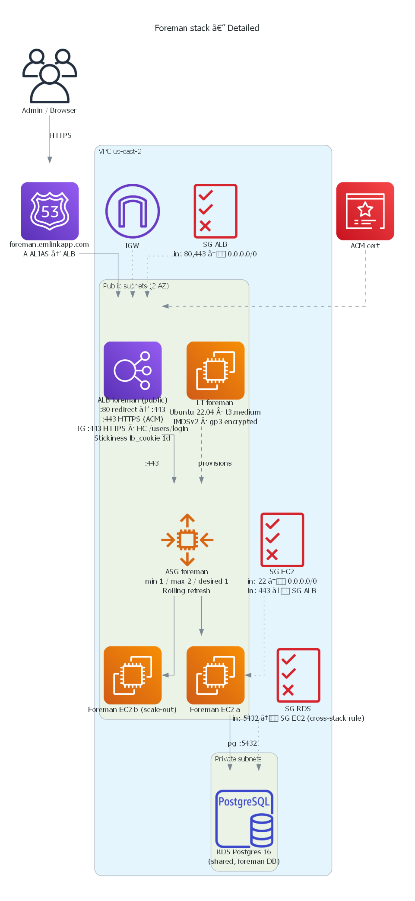
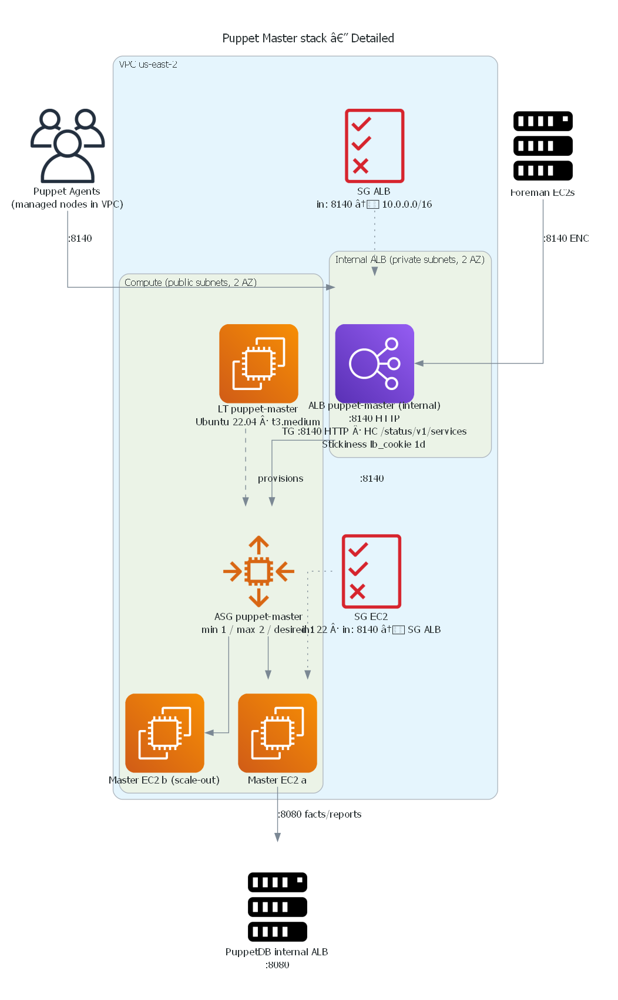
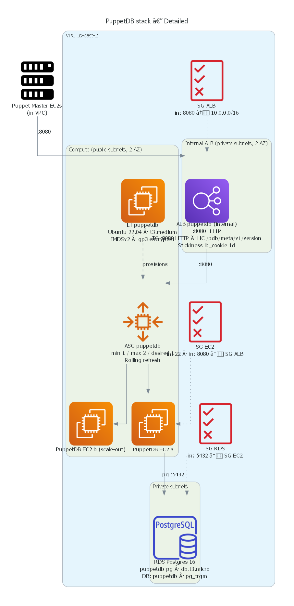
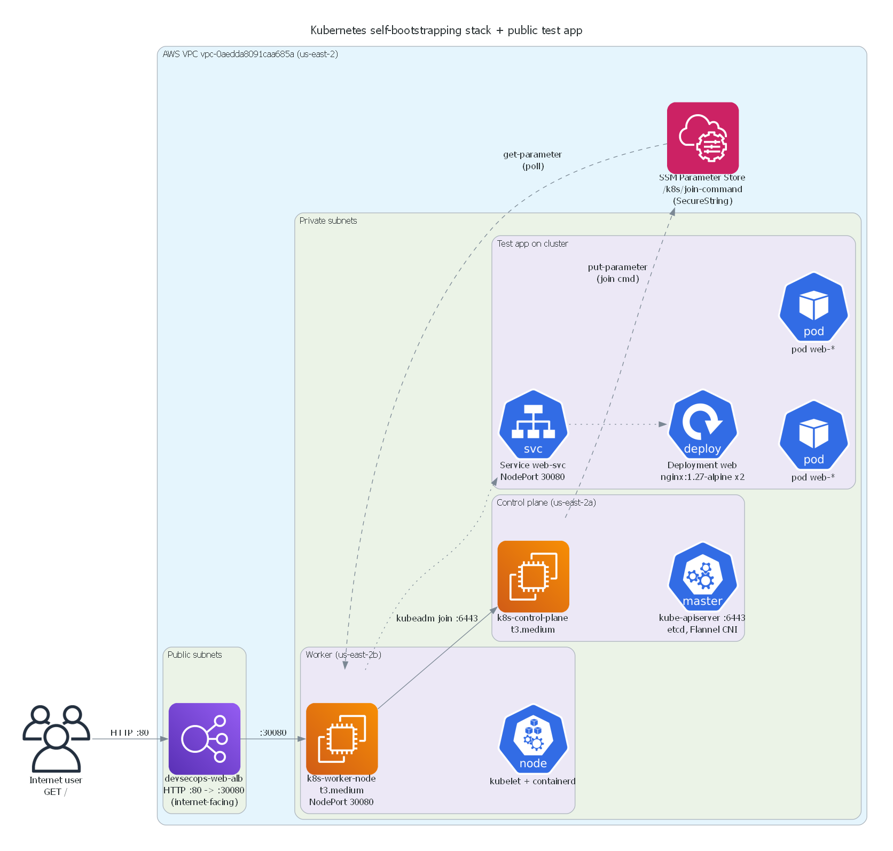
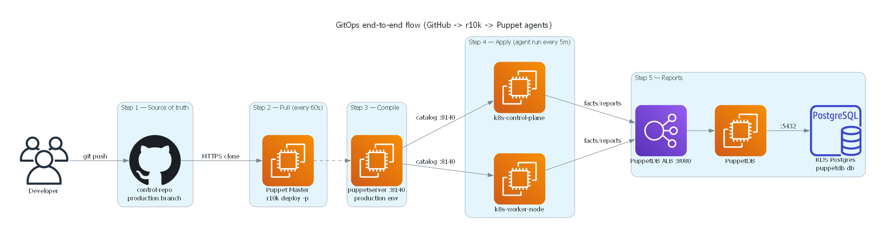
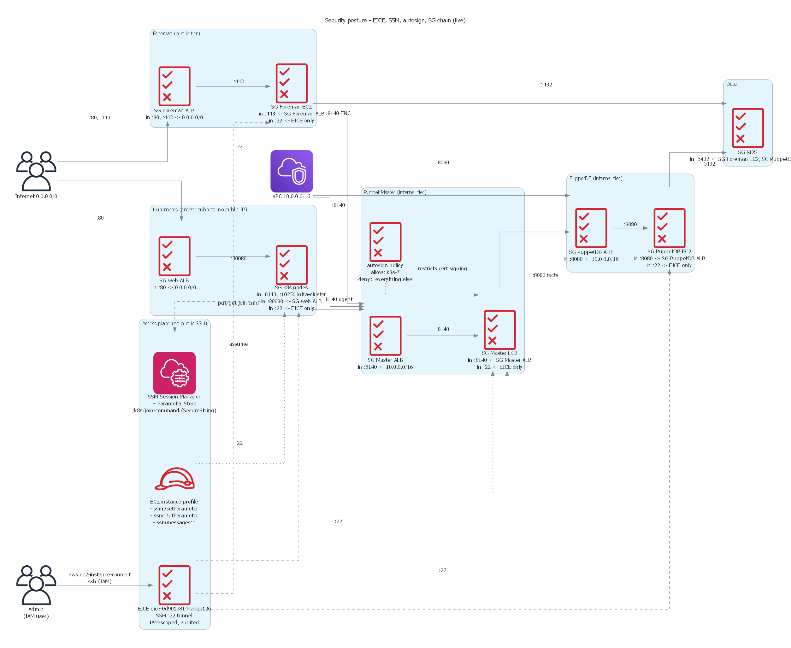

# DevSecOps Infrastructure - Puppet + Kubernetes on AWS

[](https://www.terraform.io/)
[](https://aws.amazon.com/)
[](https://puppet.com/)
[](https://kubernetes.io/)
[](LICENSE)

A production-ready **Infrastructure as Code (IaC)** project that deploys a complete DevSecOps stack on AWS, featuring:

- 🎭 **Foreman** - Web UI for Puppet node management and ENC (External Node Classifier)
- 🐙 **Puppet Master** - Configuration management with r10k GitOps workflow
- 📊 **PuppetDB** - Centralized storage for Puppet facts and reports
- ☸️ **Kubernetes** - Managed K8s cluster (control-plane + worker nodes)
- 🔐 **Security-first** - Private subnets, ALBs, ACM certificates, EICE for SSH-less access

---

## 📐 Architecture Overview

### High-Level Overview



The stack follows a layered architecture:

| Layer | Components | Access |
|-------|------------|--------|
| **Public** | Foreman ALB, Web App ALB | Internet-facing (HTTPS) |
| **Internal** | Puppet Master ALB, PuppetDB ALB | VPC internal only |
| **Private** | K8s Control Plane, Worker Nodes | No direct internet access |
| **Data** | RDS PostgreSQL | Private subnets only |

### Detailed Architecture



### Network Topology



### Data Flow



---

## 🏗️ Stack Components

### Foreman Stack


- **Public ALB** with HTTPS (ACM certificate)
- **Auto Scaling Group** (min: 1, max: 2)
- Connects to shared RDS PostgreSQL
- DNS: `foreman.emlinkapp.com`

### Puppet Masters Stack


- **Internal ALB** on port 8140
- **r10k** syncs from GitHub control-repo every 60 seconds
- Manages all Puppet agents (K8s nodes)

### PuppetDB Stack


- **Internal ALB** on port 8081
- Stores facts, catalogs, and reports
- Shared RDS PostgreSQL backend

### Kubernetes Stack


- **Control Plane**: kubeadm-initialized, etcd, Flannel CNI
- **Worker Nodes**: Auto-join via SSM Parameter Store
- **NodePort Services**: Exposed via public ALB

---

## 🔄 GitOps Workflow



```
Developer → git push → GitHub (control-repo) → r10k pull (60s) → Puppet Master → Agents
```

The Puppet control repository is the **single source of truth** for all infrastructure configuration.

---

## 🔐 Security Architecture



### Security Features

- ✅ **No public SSH** - All access via EC2 Instance Connect Endpoint (EICE)
- ✅ **Private subnets** for K8s nodes with NAT Gateway egress
- ✅ **ACM certificates** for HTTPS termination
- ✅ **Security Groups** with least-privilege access
- ✅ **IAM roles** for EC2 instances (no hardcoded credentials)
- ✅ **SSM Parameter Store** for secrets (K8s join token)

---

## 📁 Project Structure

```
DevSecOps/
├── aws/
│   ├── diagrams/                    # Architecture diagrams (Python + PNG)
│   │   ├── detailed/                # Detailed component diagrams
│   │   └── Overview/                # High-level overview diagrams
│   ├── foreman/                     # Foreman Terraform stack
│   │   ├── main.tf
│   │   └── user-data/
│   ├── puppet-masters/              # Puppet Master Terraform stack
│   │   ├── main.tf
│   │   └── user-data/
│   ├── puppetdb/                    # PuppetDB Terraform stack
│   │   ├── main.tf
│   │   └── user-data/
│   ├── puppet-slaves/               # K8s nodes Terraform stacks
│   │   ├── k8s-control-pane/
│   │   └── k8s-worker-node/
│   ├── modules/                     # Reusable Terraform modules
│   │   ├── alb/
│   │   ├── asg/
│   │   ├── network-data/
│   │   ├── rds-postgres/
│   │   └── route53-alias/
│   ├── state/                       # Terraform state & utility scripts
│   ├── deploy-infrastructure.ps1   # Main deployment script
│   └── verify-deployment.ps1       # Verification script
├── terraform-onpremise-tests/       # On-premise VMware testing
└── README.md
```

---

## 🚀 Getting Started

### Prerequisites

- [Terraform](https://www.terraform.io/downloads) >= 1.5.0
- [AWS CLI](https://aws.amazon.com/cli/) configured with appropriate credentials
- [Python 3.8+](https://www.python.org/) (for diagram generation)
- [diagrams](https://diagrams.mingrammer.com/) library (`pip install diagrams`)

### AWS Credentials Setup

**Option 1: Environment Variables (Recommended)**
```bash
export AWS_ACCESS_KEY_ID="your-access-key"
export AWS_SECRET_ACCESS_KEY="your-secret-key"
export AWS_DEFAULT_REGION="us-east-2"
```

**Option 2: AWS CLI Profile**
```bash
aws configure --profile devsecops
export AWS_PROFILE=devsecops
```

### Deployment Order

The stacks must be deployed in this order due to dependencies:

1. **PuppetDB** (creates RDS, shared by Foreman)
2. **Puppet Masters** (depends on PuppetDB ALB)
3. **Foreman** (depends on PuppetDB RDS)
4. **K8s Control Plane** (depends on Puppet Master)
5. **K8s Worker Nodes** (depends on Control Plane)

```powershell
# Deploy all stacks
.\aws\deploy-infrastructure.ps1

# Or deploy individually
cd aws/puppetdb && terraform init && terraform apply
cd aws/puppet-masters && terraform init && terraform apply
cd aws/foreman && terraform init && terraform apply
cd aws/puppet-slaves/k8s-control-pane && terraform init && terraform apply
cd aws/puppet-slaves/k8s-worker-node && terraform init && terraform apply
```

### Verify Deployment

```powershell
.\aws\verify-deployment.ps1
```

---

## 🔧 Configuration

### Terraform Variables

Each stack accepts variables for customization. Example for Foreman:

```hcl
# Set via environment variable
export TF_VAR_rds_password="your-secure-password"
export TF_VAR_foreman_admin_password="your-admin-password"

# Or via command line
terraform apply -var="rds_password=xxx" -var="foreman_admin_password=xxx"
```

### Puppet Control Repository

The Puppet Master syncs from a GitHub control repository using r10k:

```
github.com/mbulamboma/devsecops-puppet-control (production branch)
```

Update the r10k configuration in the Puppet Master user-data to point to your own control repo.

---

## 📊 Generating Diagrams

The architecture diagrams are generated using the [diagrams](https://diagrams.mingrammer.com/) Python library:

```bash
# Install dependencies
pip install diagrams

# Generate all diagrams
cd aws/diagrams/Overview
python overview.py
python network-overview.py
python data-flow-overview.py

cd ../detailed
python architecture.py
python foreman-stack.py
python puppet-masters-stack.py
python puppetdb-stack.py
python k8s-stack.py
python gitops-flow.py
python security-flow.py
```

---

## 🛡️ Security Considerations

### Before Making This Repository Public

- ✅ All secrets removed from version control
- ✅ `.gitignore` configured to exclude sensitive files
- ✅ No hardcoded passwords in Terraform files
- ✅ SSH keys excluded (`.pem` files)
- ✅ Terraform state files excluded (`.tfstate`)
- ✅ AWS credentials excluded (`secrets.yml`)

### Sensitive Files Checklist

| File Pattern | Status | Notes |
|--------------|--------|-------|
| `*.pem` | 🚫 Ignored | SSH private keys |
| `*.tfstate` | 🚫 Ignored | Terraform state |
| `secrets.yml` | 🚫 Ignored | AWS credentials |
| `*.tfvars` | 🚫 Ignored | Variable files |
| `*.log` | 🚫 Ignored | Log files |

---

## 🤝 Contributing

1. Fork the repository
2. Create a feature branch (`git checkout -b feature/amazing-feature`)
3. Commit your changes (`git commit -m 'Add amazing feature'`)
4. Push to the branch (`git push origin feature/amazing-feature`)
5. Open a Pull Request

---

## 📝 License

This project is licensed under the MIT License - see the [LICENSE](LICENSE) file for details.

---

## 👤 Author

**Mbula Mboma**

- GitHub: [@mbulamboma](https://github.com/mbulamboma)

---

## 🙏 Acknowledgments

- [Terraform AWS Provider](https://registry.terraform.io/providers/hashicorp/aws/latest)
- [Puppet Documentation](https://puppet.com/docs/)
- [Kubernetes Documentation](https://kubernetes.io/docs/)
- [Diagrams Library](https://diagrams.mingrammer.com/)
